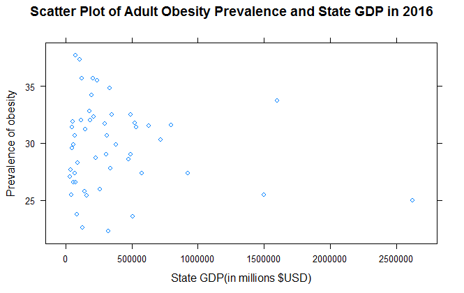

## Adult-Obesity-Prevalence-Project
#### Objective:
Obeisty is increasingly common condition in the United States, it caused by the increase on energe-in part in the body. This Project created to show the trends of adult obesity in United States and the relationship between obesity prevalence and lifestyle relevant risk factors and some socialeconemic status. 
#### Data source: 
Center of Diseases Control(CDC) and Tableau extractor
#### Methods:
#### 1) Tableau was used to visualize the trends, the public link shared over here:
https://public.tableau.com/profile/jing.li5796#!/vizhome/ObesityPrevalenceMap_15902881520760/Dashboard1?publish=yes
https://public.tableau.com/profile/jing.li5796#!/vizhome/AdultObesityPrevalenceandFactorAnalysis/FactorAnalysis?publish=yes
#### 2) Linear regression model used to detect the assoication between the socioeconomic status( GDP and Education level) and adult obesity prevalence.
The coefficient of GDP (slope) is -0.000001075, and p-value is 0.353 which indicated that the coefficient is not significant. The correlation between GDP and prevalence is-0.1326892. GDP appears to be a slight association with the prevalence and the scatter plot tell us the same story.

The coefficient of EducationLevel is -3.8683 and p-value is 2.79e-10, they are indicated that a significant negative relationship between the education level and adult obesity prevalence. The correlation test yields a same result, the correlation is -0.9175823, there is a strong evidence to show that a negative relationship between education level and adult obesity prevalence. 

The Q-Q plot showed a straight line to support the model assumption about the normal distribution of the residuals.

The grouped bar plot is created to compare the adult obesity rate with different education background.While the frequency of obesity is lower among adults with higher education background than among lower education background, for each year group the gaps is largest between those with college graduate degree and those with less than high school degree. For example, 35.5% of less than high school adult and 22.2% of college graduate adult were obese in 2016.
##### Code I used would be found below
### install required packages
	library(reshape2)
	library(ggplot2)
	library(data.table)
	### loading .csv format data
	education <- read.csv("C:/Users/Jing/Desktop/STAT663_Project/ObesityEducation2011_2016.csv")
	education
	education1 <-melt(education, id.vars='Year', measure.vars=c('Less.than.High.school',
	                                                            'High.school.graduate',
	                                                            'Some.college.or.technical.school',
	                                                            'College.graduate'))
	education1 <-data.table(education1)
	education1
	### create histogram to show the trends between the education status and adult obesity prevalence
	ggplot(education1,aes(x=factor(Year,
	                               levels=levels(education1$Year)[c(6,5,4,3,2,1)]),
	                      y=value,
	                      fill=factor(variable,
	                                  levels=levels(education1$variable)[c(4,3,2,1)])))+
	  geom_bar(stat='identity',
	           position=position_dodge())+
	  geom_text(aes(x=Year,y=value,label=value,
	                color=factor(variable,
	                             levels=levels(education1$variable)[c(4,3,2,1)])),
	                position=position_dodge(width=0.9),
	                show.legend=F)+
	  ggtitle('Obesity Rate Among Adults Ages 18 and Older,by Education Level, 2011-2016')+
	  scale_fill_discrete(name='Education Level',
	                      labels=levels(education1$variable)[c(4,3,2,1)])+
	  scale_x_discrete(name='Year',
	                   labels=levels(education1$Year)[c(6,5,4,3,2,1)])+
	  scale_y_continuous(name='obesity rate',
	                     breaks=seq(0,40,10),
	                     limits=c(0,40))
	                     
	library(ggplot2)
	library(lattice)
	obesityGDP = read.csv("C:/Users/Jing/Desktop/STAT663_Project/obesityGDP.csv", header=T)
	### fit linear regression model - State GDP and obesity prevalence
	simple.fit = lm(prevalence~GDP, data=obesityGDP)
	summary(simple.fit)
	### linear regression assumption - scatter plot
	xyplot(prevalence ~ GDP, data = obesityGDP, 
	       xlab = "State GDP(in millions $USD)",
	       ylab = "Prevalence of obesity",
	       main = "Scatter Plot of Adult Obesity Prevalence and State GDP in 2016")
	qqnorm(simple.fit$resid,main="Q-Q Plot for Obesity Prevalence and State GDP ")
	qqline(simple.fit$resid)
	res<- cor.test(obesityGDP$prevalence, obesityGDP$GDP,
	               method = "pearson")
	res
	

	ObesityEdu = read.csv("C:/Users/Jing/Desktop/STAT663_Project/obesityEducationRegression.csv", head=T)
	### fit the linear regression -  education level vs. obesity prevalence
	simple.fit2 = lm(ObesityRate~EducationLevel, data=ObesityEdu)
	summary(simple.fit2)
	### linear regression assumption - scatter plot
	xyplot(ObesityRate~EducationLevel, data=ObesityEdu,
	       xlab = "Education Level",
	       ylab = "Obesity rate",
	       main = "Scatter Plot of Adult Obesity Rate and Education Level")
	plot(simple.fit2$resid~ObesityEdu$EducationLevel[order(ObesityEdu$EducationLeve)],
	      main="EducationLevel x Residuals\nfor Simple Regression",
	      xlab="Eucational Level", ylab="Residuals")
	abline(h=0,lty=2)
	qqnorm(simple.fit2$resid,main="Q-Q Plot for Education Level and Adult Obesity Rate")
	qqline(simple.fit2$resid)
	                                                 
	res2<- cor.test(ObesityEdu$ObesityRate, ObesityEdu$EducationLevel,
	                conf.int = TRUE, cor.coef = True,
	                method = "pearson")
	res2
